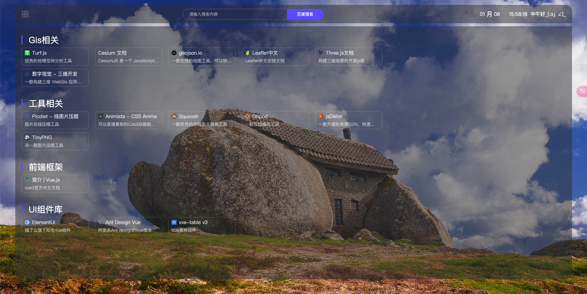
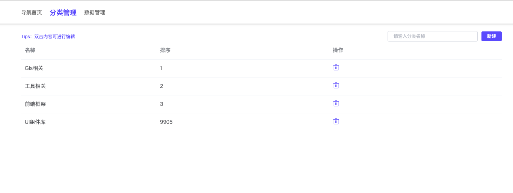
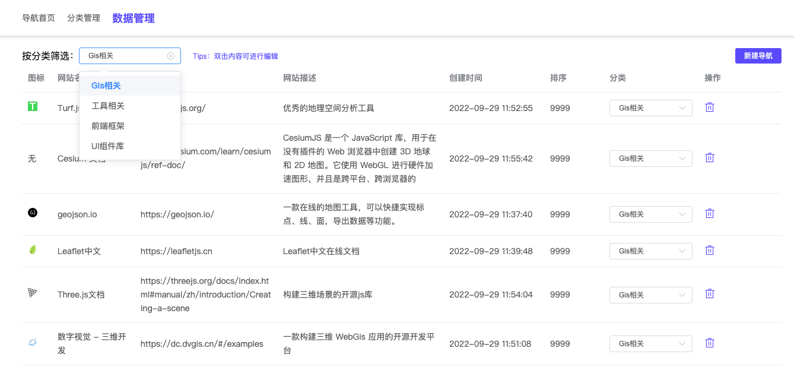

一个简易且精美的私有化内网导航系统

采用 Koa + Swig + Vue2 技术栈开发, Nodejs 版本推荐：  `v14.x`

## 演示

##### 视频演示

<video width="100%" height="auto" controls>
  <source src="./docs/videos/show.mp4" type="video/mp4">
</video>

##### 首页

##### 分类管理

##### 导航数据管理

## 安装和部署